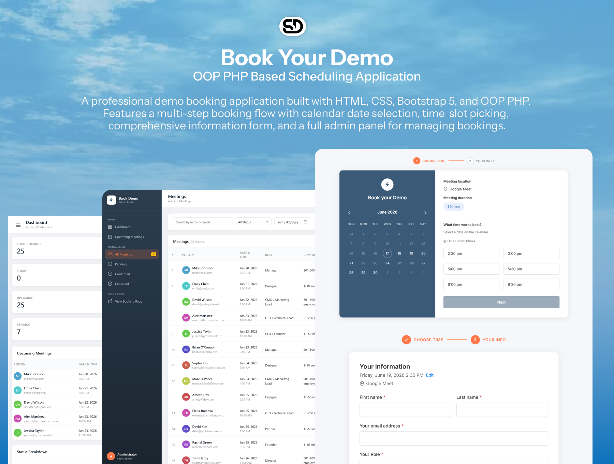

<div align="center">

# 🗓️ Book Your Demo

### OOP PHP Based Scheduling Application

[](https://suvro.byethost24.com/book-your-demo/)
[](LICENSE)
[](https://getbootstrap.com/)
 
<br>



<br>

A professional demo booking application built with **HTML, CSS, Bootstrap 5, and OOP PHP**. Features a multi-step booking flow with calendar date selection, time slot picking, comprehensive information form, and a full **admin panel** for managing bookings.

[🌐 Live Preview](https://suvro.byethost24.com/book-your-demo/) · [📥 Download](https://github.com/shuvrod564/book-demo-system/archive/refs/heads/main.zip)

</div>

---
 
## Features

### Public Booking Flow
- **Step 1 - Choose Time**: Interactive calendar with month navigation, date selection, and time slot picking
- **Step 2 - Your Information**: Complete form with validation (name, email, role, company size, etc.)
- **Step 3 - Confirmation**: Booking summary with all details
- **Guest Management**: Add up to 10 guest emails to the meeting
- **AJAX Time Slots**: Dynamic time slot loading without page refresh

### Admin Panel
- **Secure Login**: Password-authenticated admin login with session management
- **Dashboard**: Overview statistics (total, today, upcoming, pending), upcoming meetings list, status breakdown
- **Upcoming Meetings**: View and filter meetings scheduled for future dates
- **All Meetings**: Complete list with search, filter by status/date, and sorting
- **Meeting Details**: Read-only view of all booking information
- **Edit Meeting**: Update meeting details, change status, reschedule
- **Delete Meeting**: Remove bookings with confirmation prompt
- **Status Management**: Quick status updates (Pending, Confirmed, Completed, Cancelled)
- **Responsive Sidebar**: Collapsible navigation with pending count badges

### Technical Features
- **Form Validation**: Client-side (JavaScript) and server-side (PHP) validation
- **Responsive Design**: Works on desktop, tablet, and mobile
- **OOP Architecture**: Clean code with PHP classes (Database, Booking, Calendar, Validator, Meeting, Admin)
- **Session Management**: Multi-step form data persistence and admin authentication
- **Flash Messages**: Success/error notifications after actions
- **Search & Filter**: Find meetings by name, email, status, date range

## Technology Stack
- **Frontend**: HTML5, CSS3, Bootstrap 5.3, JavaScript (Vanilla)
- **Backend**: PHP 8+ (OOP with PDO)
- **Database**: MySQL / MariaDB
- **Font**: Inter (Google Fonts)

## File Structure
```
book-demo/
├── index.php                          # Main entry point / router
├── step1.php                          # Step 1: Calendar & time selection
├── step2.php                          # Step 2: Personal information form
├── step3.php                          # Step 3: Confirmation page
├── css/
│   ├── style.css                      # Frontend booking styles
│   └── admin.css                      # Admin panel styles
├── js/
│   ├── app.js                         # Frontend JavaScript
│   └── admin.js                       # Admin panel JavaScript
├── ajax/
│   └── get_timeslots.php              # AJAX endpoint for time slots
├── admin/
│   ├── login.php                      # Admin login page
│   ├── logout.php                     # Admin logout handler
│   ├── dashboard.php                  # Dashboard with stats & overview
│   ├── meetings.php                   # All meetings list with filters
│   ├── meeting_view.php               # Meeting detail view
│   ├── meeting_edit.php               # Edit meeting details & status
│   └── meeting_delete.php             # Delete meeting handler
├── includes/
│   ├── config.php                     # Application configuration
│   ├── classes/
│   │   ├── Database.php               # Singleton PDO wrapper class
│   │   ├── Booking.php                # Booking model (front-end)
│   │   ├── Calendar.php               # Calendar generation class
│   │   ├── Validator.php              # Form validation class
│   │   ├── Meeting.php                # Meeting model (admin CRUD & stats)
│   │   └── Admin.php                  # Admin authentication class
│   └── partials/
│       ├── admin_sidebar.php           # Sidebar navigation partial
│       └── admin_topbar.php            # Top navigation bar partial
├── database.sql                        # MySQL schema with sample data
└── README.md                           # This file
```

## Installation

### 1. Database Setup
1. Create a MySQL database:
   ```sql
   CREATE DATABASE book_demo;
   ```
2. Import the schema (includes admin table and sample data):
   ```bash
   mysql -u root -p book_demo < database.sql
   ```

### 2. Configuration
Edit `includes/config.php` to update your database credentials:
```php
define('DB_HOST', 'localhost');
define('DB_NAME', 'book_demo');
define('DB_USER', 'root');
define('DB_PASS', 'your_password');
```

### 3. Deploy
1. Copy the entire `book-demo/` folder to your web server's document root (e.g., `htdocs/`, `www/`, or `var/www/html/`)
2. Access the booking page at: `http://localhost/book-demo/`
3. Access the admin panel at: `http://localhost/book-demo/admin/`

### Default Admin Credentials
- **Username**: `admin`
- **Password**: `admin123`

> **Important**: Change the default password after first login by updating the `admins` table in the database.

### Requirements
- PHP 8.0 or higher
- MySQL 5.7+ or MariaDB 10.3+
- Apache/Nginx web server
- PDO PHP extension enabled
- session PHP extension enabled

## OOP Architecture

### Classes

#### `Database` (Singleton Pattern)
- Singleton PDO wrapper with prepared statements
- Methods: `query()`, `fetchOne()`, `fetchAll()`, `insert()`, `update()`, `delete()`

#### `Booking` (Active Record Pattern)
- Front-end booking model with step validation
- Step 1 & Step 2 validation methods
- Data hydration and serialization

#### `Calendar`
- Dynamic monthly calendar generation
- Month navigation (previous/next)
- Date selection and past-date disabling
- Formatted date output

#### `Validator`
- Fluent rule definition with method chaining
- Built-in rules: required, email, url, maxLength, inList, guestEmails
- Input sanitization utilities

#### `Meeting` (Active Record Pattern)
- Full CRUD operations for admin management
- Static query methods with filtering (status, date range, search)
- Dashboard statistics: `getStats()`, `getStatusBreakdown()`, `getDailyBookingsThisMonth()`
- Status management, upcoming/today queries
- Computed properties: `isUpcoming()`, `isToday()`, `getDaysUntil()`, `getStatusBadge()`

#### `Admin`
- Login/logout with bcrypt password verification
- Session-based authentication
- `requireLogin()` guard for protected pages
- Fallback hardcoded credentials when database is unavailable
- Admin CRUD operations

## Admin Panel Pages

| Page | URL | Description |
|------|-----|-------------|
| Login | `/admin/login.php` | Secure admin authentication |
| Dashboard | `/admin/dashboard.php` | Stats, upcoming meetings, status breakdown |
| All Meetings | `/admin/meetings.php` | Searchable, filterable meeting list |
| Upcoming | `/admin/meetings.php?type=upcoming` | Future meetings only |
| By Status | `/admin/meetings.php?status=pending` | Filter by status |
| View Meeting | `/admin/meeting_view.php?id=X` | Full meeting details |
| Edit Meeting | `/admin/meeting_edit.php?id=X` | Update details & status |
| Delete Meeting | `/admin/meeting_delete.php` | POST handler for deletion |

## Customization
- **Time Slots**: Edit `TIME_SLOTS` in `includes/config.php`
- **Meeting Duration**: Change `MEETING_DURATION` constant
- **Form Options**: Modify `ROLE_OPTIONS`, `EMPLOYEE_OPTIONS`, `AI_SEARCH_OPTIONS`, `REFERRAL_OPTIONS`
- **Admin Credentials**: Update `ADMIN_USERNAME` and `ADMIN_PASSWORD` in config, or the `admins` database table
- **Colors**: Update CSS variables in `css/style.css` and `css/admin.css`
- **Timezone**: Adjust `TIMEZONE` constant and the timezone selector display

## License
This project is open source and available for personal and commercial use.
